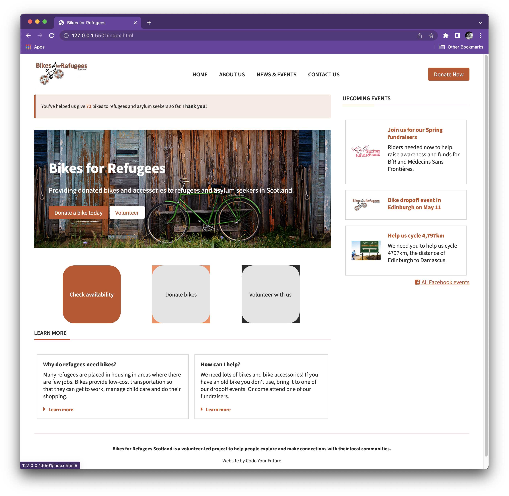
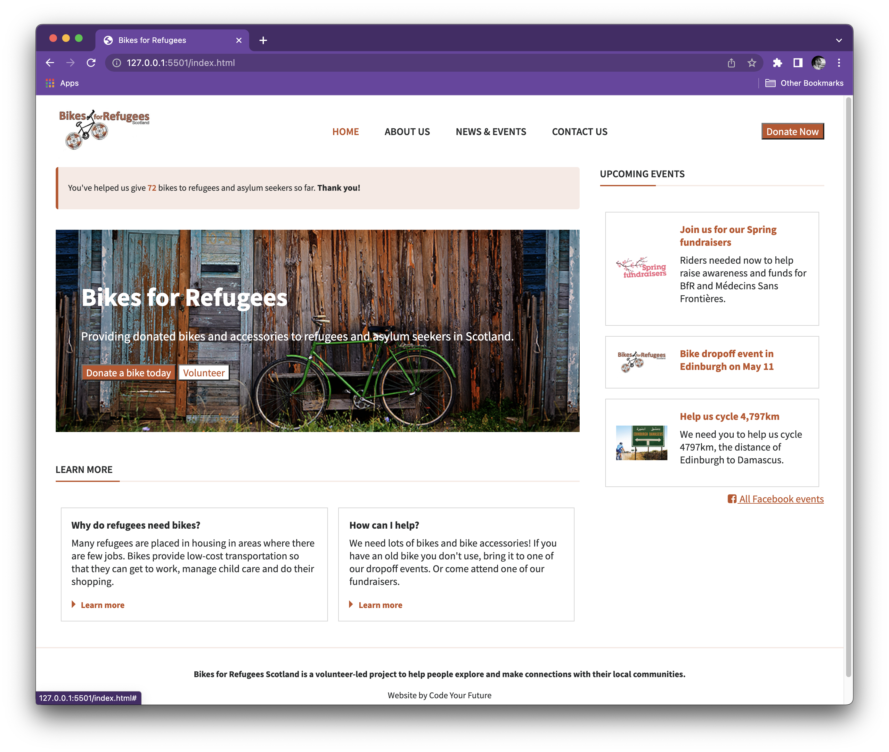

# bikes-for-refugees

Exercise for HTML & CSS - lesson 1

## [Live Demo](https://bikes-for-refugeess.netlify.app/)

## V2_Flexbox-added

## V1_all tasks

### Exercise 1) Use semantic markup

Where necessary, replace the `
`s with semantic HTML tags. This will not render differently in the browser, but it's good practice to use semantic markup when you can!

### Exercise 2) Fix the broken images

Some of the links to images are broken. The images you need are in the `images` folder - please replace any broken image links with the correct paths.
It's also good practice to include a description of the image in the `alt` attribute.

Make sure to add some CSS to make the images look the same as in the design!

### Exercise 3) Style buttons

There are 3 buttons on the page: can you style them correctly so they follow the design?
**Remember**, re-use styles as much as possible by using CSS classes.

### Exercise 4) Add spacing

- Add more space **inside** the hero section so that more of the image is visible.
- Add more space **below** the hero section to move the 'Learn more' section down.
- Use the `padding` property to add some more horizontal space between the navigation links in the header.

### Exercise 5) Fix the positioning

Compare what you can see in your browser with the design provided. Can you spot the differences in layout? Use CSS Flexbox to move elements around so they are positioned correctly.

Also add borders and spacing if required to match the design.

### Bonus: hover effects

Add a hover effect using CSS, so that:

1. The links in the top menu navigation become orange on hover
2. The colours of the buttons are inverted on hover

## Submit your work

Once you've finished, **open a pull request** so your work can be reviewed by a mentor.

As always, you can check [the git cheatsheet](https://syllabus.codeyourfuture.io/git/desktop/cheatsheet#i-want-to-send-my-code-to-volunteers-pushing) if you get stuck!
